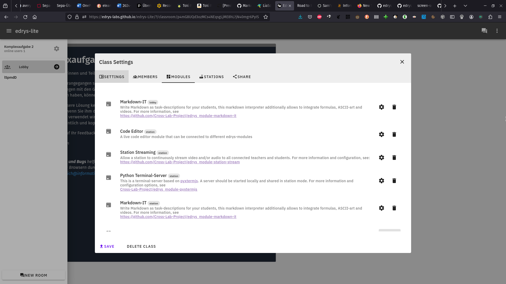
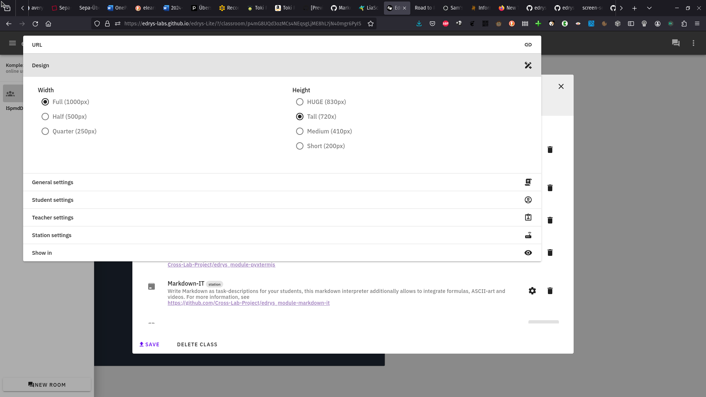
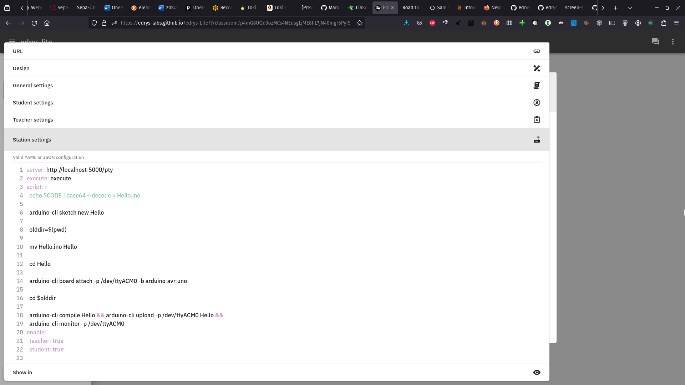
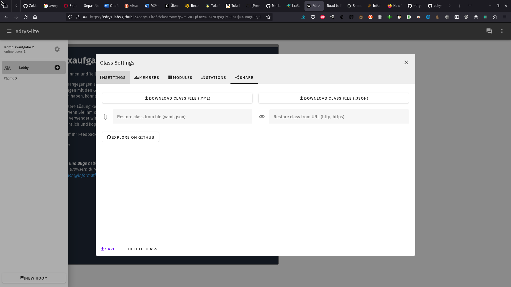

<!--

@highlight: <!-- style="color: @0" -->

@done: @highlight(green)

@ignore: @highlight(gray)

@blue: @highlight(blue)

@warn: @highlight(olive)

@embed: <iframe src="https://api.allorigins.win/raw?url=@0" style="width: 100%; height: 60vh;"></iframe>

-->

# Projekttreffen

<!-- data-show -->
| TAP  | AP 1 | AP 2 | AP 3 | AP 4 | AP 5 | AP 6 | AP 7 | AP 8 |
| ---- |:----:|:----:|:----:|:----:|:----:|:----:|:----:|:----:|
| AP 1 |      |  1   |      |      |  1   |      |  1   |  1   |
| AP 2 |      |      |  1   |  1   |      |  1   |  1   |  1   |
| AP 3 |      |      |      |  1   |  1   |  1   |      |  1   |
| AP 4 |      |      |      |      |  1   |  1   |  1   |  1   |
| AP 5 |      |      |      |      |      |      |  1   |  1   |
| AP 6 |      |      |      |      |      |      |      |  1   |
| AP 7 |      |      |      |      |      |      |      |  1   |
| AP 8 |      |      |      |      |      |      |      |      |


## AP 1

___Technische, didaktische und organisatorische Bestandsaufnahme der bestehenden digitalen Laborinfrastrukturen___

Monat 1 - 9

<!-- data-show data-title="Personenmonate"-->
| TU Freiberg | TU Ilmenau | TU Dortmund | NORDAKADEMIE |
|:-----------:|:----------:|:-----------:|:------------:|
|    9 PM     |    2 PM    |    15 PM    |     3 PM     |


> Die systematische Erfassung bestehender digitalen Labore dient der Klassifikation der individuellen technischen Umsetzung, der didaktischen Zielstellungen und gewünschter Adaptionen/Ergänzungen für die Verwendung. Die Hürden für eine hochschulübergreifende Nutzung wird anhand einer deutschlandweiten Online-Umfrage kategorisiert, damit diese im Projektverlauf abgebaut werden können.

---------------------------------------------------------------------------
TAP
---------------------------------------------------------------------------

1. @ignore
   Erfassung und Vergleich der bisherigen didaktischen Zielstellungen und deren Umsetzung in den digitalen Laboren der Partnerhochschulen

2. @ignore
   Erfassung und Vergleich der von den verschiedenen Fachdisziplinen eingesetzten didaktischen Methoden

3. @done
   Analyse der verfügbaren Open-Source Frameworks für die Umsetzung von konventionellen Remote-Laboren mit Blick auf die Adaption und Konfigurierbarkeit

4. @done
   Ableitung von potenziellen Nutzungs- und Konfigurationsmustern für die hochschulübergreifende Verzahnung von digitalen Laborobjekten

5. @warn
   Deutschlandweite Online-Umfrage zu Hürden bei der Integration von Remote-Laboren an externen Standorten

---------------------------------------------------------------------------
Beitrag
---------------------------------------------------------------------------

- @blue
  __TU Freiberg__
  koordiniert den Prozess, entwirft eine übergreifende Klassifikationssystematik für die technische Umsetzung von digitalen Laboren und analysiert die Systeme am Standort

- __TU Ilmenau__
  liefert einen detaillierten Überblick über die bestehende GOLDi Cloud Infrastruktur und die existierenden Lernobjekte und die damit verbundenen Einsatzmöglichkeiten für das Projektvorhaben

- __TU Dortmund__
  ermittelt durch eine teilstandardisierte Erhebung den didaktischen und lehrorganisationsbezogenen Ausgangszustand der digitalen Labore an den Partnerhochschulen und führt eine Online-Umfrage zu Hürden bei der Integration Remote-Laboren durch. 

- __Die NORDAKADEMIE__
  evaluiert die intendierten Ziele in Hinblick auf die Eignung für eine industrienahe und berufsvorbereitende Lehre.

---------------------------------------------------------------------------
Ergebnisse
---------------------------------------------------------------------------

Übersicht zu den Nutzungs- und Umsetzungskonzepten von Remote-Laboren an den Partnerstandorten, Erfassung des Potentials übergreifender konfigurierbarer digitaler Lernobjekte

<section>

---------------------------------------------------------------------------
### Erledigt

{{1}} Analyse unterschiedlicher RemoteLabor Frameworks/Ansätze/Instanzen

{{2}}
*****************
Auswahl des _edrys-Systems_ Aufgrund des modularen Ansatzes

@[embed](https://github.com/topics/edrys-lite)
*****************

{{3}}
*****************
und der Nutzung des Rollenmodells und Infrastruktur


*****************

{{4}}
*****************
und der Nutzung des browserbasierten Ansatzes zum Teilen von Hardware über Stationen


*****************

</section>

---------------------------------------------------------------------------

__Verbunden mit:__
[AP 2](#AP-2),
[AP 5](#AP-5),
[AP 7](#AP-7)


## AP 2

___Softwarearchitektur und Schnittstellenentwurf___

Monat 1 - 18

<!-- data-show data-title="Personenmonate"-->
| TU Freiberg | TU Ilmenau | TU Dortmund | NORDAKADEMIE |
|:-----------:|:----------:|:-----------:|:------------:|
|    9 PM     |   40 PM    |    3 PM     |     9 PM     |

> Die Konzeption und der Entwurf der integrativen Laborinfrastruktur ist die Grundlage für die technische Realisierung des Gesamtkonzepts. Hierbei wird unter anderem besonderer Wert auf standardisierbarer Schnittstellen zwischen den kombinierbaren Laborobjekten gelegt, um die Wiederverwendbarkeit sicherzustellen.

---------------------------------------------------------------------------
TAP
---------------------------------------------------------------------------

1. @ignore
   Basierend auf Recherchen zu bestehenden Versuchen sowie relevanten Standards von Lehr- und Lernumgebung sowie Industrie- und Webstandards werden die detaillierten Anforderungen an die Infrastruktur erhoben, um das Projektziel zu erreichen.

2. @ignore
   Es wird eine Softwarearchitektur für die entsprechenden Anforderungen erstellt. Die für die Interoperabilität notwendigen Schnittstellen und Protokolle werden fixiert.

3. @blue
   Entwurf von potenziellen Nutzungs- und Konfigurationsmuster für die hochschulübergreifende Verzahnung von digitalen Laborobjekten

4. @blue
   Konzeption einer Verteilungs- und Updatestrategie sowie Monitoringlösung für die Gesamtarchitektur (Design for Maintainability).

5. @ignore
   Festlegung der Teststrategie auf Modul und Integrationsebene (Design for Testability)

---------------------------------------------------------------------------
Beitrag
---------------------------------------------------------------------------

- @blue
  __TU Freiberg__
  begleitet die Entwicklung des Architekturentwurfes aus Sicht der avisierten Anwendungen aus Freiberg.

- __TU Ilmenau__
  koordiniert den Prozess und übernimmt federführend die Planung der Gesamtarchitektur

- __TU Dortmund__
  begleitet das AP aus didaktischer Sicht.

- __NORDAKADEMIE__
  konzipiert Anforderungen und evaluiert in der Industrie eingesetzte Systeme in Hinblick auf die Schnittstellenanbindung.

---------------------------------------------------------------------------
Ergebnisse
---------------------------------------------------------------------------

Softwarearchitekturdokumentation (PDF)

---------------------------------------------------------------------------

__Verbunden mit:__
[AP 1](#AP-1),
[AP 3](#AP-3),
[AP 4](#AP-4),
[AP 6](#AP-6),
[AP 7](#AP-7)


## AP 3

___Implementierung der Laborinfrastruktur___

Monat 7 - 26

<!-- data-show data-title="Personenmonate"-->
| TU Freiberg | TU Ilmenau | TU Dortmund | NORDAKADEMIE |
|:-----------:|:----------:|:-----------:|:------------:|
|    15 PM    |   24 PM    |    3 PM     |    12 PM     |

> In diesem Arbeitspaket wird das laborseitige Konzept aus AP2 technisch realisiert. Insbesondere also die Systemkomponente Labor-Bus und das Konfigurationsinterfaces der digitalen Laborinstallationen. Es kommen Methoden der agilen Softwareentwicklung zum Einsatz.

---------------------------------------------------------------------------
TAP
---------------------------------------------------------------------------

1. Implementierung eines Prototyps für die Konfigurationsschnittstellen
2. Umsetzung des Labor-Busses
3. Bereitstellung einer Testumgebung pro Standort und als Integrationstest über alle Standorte hinweg.
4. Umsetzung des Monitoring- und der Verteilungsstrategie
5. Realisierung spezifischer Anpassungen für die Installationen bei den Partnern in Bezug auf Laborelementanbindungen, Lernsystemintegration, Identitätsmanagement usw.

---------------------------------------------------------------------------
Beitrag
---------------------------------------------------------------------------

- @blue
  __TU Freiberg__
  implementiert die Schnittstellen für die am Standort Freiberg vorgesehenen digitalen Laborinstanzen.

- @ignore
  __TU Ilmenau__
  übernimmt den Prozess der Prototypenimplementierung und koordiniert die Implementierung bei den Verbundpartnern

- @ignore
  __TU Dortmund__
  begleitet das AP aus didaktischer Sicht.

- @ignore
  __NORDAKADEMIE__
  realisiert Testumgebung für die lokalen Laboranbindungen mit Continuous Integration/ Continuous Deployment-Konzept und bindet diese an die Integrationstests an

---------------------------------------------------------------------------
Ergebnisse
---------------------------------------------------------------------------

Umsetzung der Softwarearchitektur Laborinstallationen

---------------------------------------------------------------------------
Erledigt
---------------------------------------------------------------------------

{{1}}
*********************
__Nutzung und Erweiterung des alten edrys-Systems__

``` ascii
     🧪 --.      .-- 👩‍💻
 (station) \    /  (user)

  👩‍💻 ------  🖥️  ------ 👨🏾‍💻
(user)                (user)
           /    \
     👨🏾‍💻 --'      '-- 🤖
    user)         (station)
```

(Login per Mail erforderlich)
*********************

{{2}}
*********************
__Re-Implementierung einer zu edrys kompatiblen und "serverlosen" light Variante als reiner browserbasierter Peer-to-Peer Ansatz:__

``` ascii
      (peer) (peer)
- - - --👨🏾‍💻---- 👩‍💻
              /  \
  (peer)     /    \
    👩‍💻----- 🤖 --- 🤖- - -
      \    /  \    /
       \  /    \  /
        👨🏾‍💻----- 👩‍💻- - - -
      (peer) (peer)
```


* Kein Login
* Teilen von Räumen/Laboren über eindeutige (geheime) URLs
* Migration durch "Forks" (Kopien mit anderer URL)
* es muss mindestens ein Teilnehmer (Station) bereits den Raum geöffnet haben um die Konfiguration zu laden und weiterzugeben

*********************

{{3}} https://edrys-labs.github.io/edrys-Lite/

---------------------------------------------------------------------------

Verbunden mit:
[AP 2](#AP-2),
[AP 4](#AP-4),
[AP 5](#AP-5),
[AP 6](#AP-6)


## AP 4

___Nutzungszentrierte Konfiguration und Integration der Laborobjekte___

Monat 1 - 36


<!-- data-show data-title="Personenmonate"-->
| TU Freiberg | TU Ilmenau | TU Dortmund | NORDAKADEMIE |
|:-----------:|:----------:|:-----------:|:------------:|
|    27 PM    |   15 PM    |    3 PM     |    36 PM     |


> Während AP3 die laborseitigen Lösungen entwirft fokussiert AP4 die Lernenden-Sicht. Dabei soll anhand der Konfigurationsinformationen des Lehrenden das User Interface automatisch mit den entsprechenden Inhalten generiert werden. Dabei ist trotz der Variabilität eine Administrierbarkeit ohne spezifische Kenntnisse sowie eine hinreichende Usability und Barrierefreiheit zu gewährleisten. Zum anderen gilt es dieses CrossLab-User Interface in die an den Standorten etablierten Lehr-Lernumgebungen zu integrieren.

---------------------------------------------------------------------------
TAP
---------------------------------------------------------------------------

1. @blue
   Abbildung von abstrakten Anforderungen an das User Interface auf ein UI/UX konformes Design
2. @ignore
   Entwicklung einer Infrastruktur zur Buchung, Gewährleistung der Verfügbarkeit und Sicherheit. Bereitstellung von Funktionalitäten für Userfeedback
3. @blue
   Integration mehrsprachiger Instruktionen/Nutzungsschnittstellen, die semiautomatisch anhand von Beschreibungsinhalten generiert werden
4. @blue
   Nutzungsgerechte Integration der CrossLab User Interfaces in existierende Lehrmittel z.B. Moodle, Ilias, PowerPoint
5. @blue
   Entwicklung des Administrationsinterfaces für den Lehrenden zur Konfiguration des Laborsystems

---------------------------------------------------------------------------
Beitrag
---------------------------------------------------------------------------

- @blue
  __TU Freiberg__
  entwirft und implementiert auf der Basis bestehender Beschreibungskonzepte für Lehr-Lerninhalte das Konfigurationstool.

- __TU Ilmenau__
  übernimmt Anbindung des bestehenden GOLDi-Remotelabs in die CrossLab Infrastruktur.

- __TU Dortmund__
  begleitet das AP aus didaktischer Sicht und koordiniert den Unterauftrag an LabsLand.

- Die __NORDAKADEMIE__
  konzipiert ein Reservierungssystem für gewünschte Zeiten (z.B. Vorlesungstermine), die Sicherheit der Kommunikation zwischen Anwender und Versuchsaufbau durch Verschlüsselung und ein Verfahren zur Protokollierung (Nutzungszeiten). Hilfsmittel für die Administration von Laborobjekten werden erstellt.

Es wird eine möglichst _niedrigschwellige Einbindung_ in existierende Lehre umgesetzt und eine kontinuierliche Begleitung und Evaluation der Nutzbarkeit des CrossLab-Systems während der Entwicklung durchgeführt. 

---------------------------------------------------------------------------
Ergebnisse
---------------------------------------------------------------------------

-[X] Konfigurationstool, 
-[X] Einbindung existierender Remote-Labore,
-[ ] Reservierungssystem, Konzept zur Kommunikationssicherheit,
-[ ] Usability-Guideline für Laborobjekte, Hilfsmittel zur Einbindung und Administration von Laborobjekten in die CrossLab-Umgebung

---------------------------------------------------------------------------
Erledigt
---------------------------------------------------------------------------

{{1}}





{{2}}
```` yaml  Arduino.yaml
id: Msw5YCj3DZzflNZTRLTr8PbUQO721rmpCxZlDqRN
createdBy: Mj92OSQdrbcE
dateCreated: 1689064662293
name: Komplexaufgabe 0
meta:
  logo: >-
    https://raw.githubusercontent.com/edrys-labs/lab-arduino-basics/main/logo.jpeg
  description: >-
    Die Studierenden wenden die Kenntnisse zur hardwarenahen Konfiguration und
    Nutzung von Eingangs-/Ausgangs-Pins an. Dazu wird ein Anwendungsbeispiel aus
    der Arduino-Welt teilweise auf die Nutzung der avrlibc umgestellt. Im
    Ergebnis steht eine Applikation die kontinuierlich die Distanz zu einem
    Hindernis vermisst.
  selfAssign: true
members:
  teacher: []
  student: []
modules:
  - url: >-
      https://raw.githubusercontent.com/edrys-labs/module-markdown-it/2.0.0/index.html
    config: >
      # Komplexaufgabe 0

      Liebe Teilnehmerinnen und Teilnehmer,

      dies ist die erste Komplexaufgabe, die Ihnen Gelegenheit geben soll,
      sich zusätzlich zu den praktischen Übungen mit den Grundlagen der
      Programmierung eingebetteter Systeme vertraut zu machen. Wir werden
      nunmehr jede Woche eine neue Aufgabe für Sie freischalten. Die
      Aufgaben sind so konzipiert, dass Sie die Lösung selbstständig
      erarbeiten können. Sollten Sie dennoch Fragen haben, können Sie sich
      gerne an die Betreuer wenden.

      Wir haben uns für eine Remote-Lösung entschieden, da die Aufbauten 
      Schritt für Schritt immer aufwändiger werden. Entsprechend erlaubt
      uns der Webzugriff einen ressourcensparenden und zeiteffizienten
      Einsatz der Setups. Die Umsetzung dieser Remote-Lösung ist für uns
      alle neu und wir bitten Sie daher um Verständnis, falls es zu Anfang
      noch zu Problemen kommen sollte.

      Noch umfasst unsere Lösung keinen Multi-User-Modus - entsprechend
      könnten Sie einen Kommilitonen ziemlich ärgern, wenn Sie ihm die
      Kontrolle entziehen.

      Prüfen Sie also bitte vorher, ob das Setup gerade von jemand anderem
      verwendet wird.

      Die „Station“ merkt sich immer den letzten Stand, verlassen Sie Ihren
      Arbeitsplatz ordentlich und kopieren sie vor dem verlassen einfach den
      Original-Code in den Editor ...

      Wir freuen uns auf Ihr Feedback und Ihre Anregungen.

      _Ihr CrossLab Team_

      > Bei __Problemen und Bugs__ helfen uns Screenshots und auch Kopien
      > der Developer-Konsole, diese öffnet sich in den meisten Browsern
      > durch die Tasten-Kombination:
      > <kdb>Ctrl</kdb>-<kdb>Shift</kdb>-<kdb>i</kdb> ... 
    studentConfig: ''
    teacherConfig: ''
    stationConfig: ''
    showInCustom: lobby
    width: full
    height: huge
  - url: https://edrys-labs.github.io/module-editor/index.html
    config:
      editorText: |
        #include <Wire.h>
        #include <LiquidCrystal_PCF8574.h>

        int lcdi2c = 0x27; // <- Hart eingecodete Adresse, vgl. Datenblatt
        LiquidCrystal_PCF8574 lcd(lcdi2c);

        const int trigPin = 12;
        const int echoPin = 11;

        void setup()
        {
          lcd.begin(16, 2);
          lcd.setBacklight(255);
          lcd.clear();
          lcd.setCursor(0, 0);
          lcd.print("#CrossLab - 2024");
          lcd.setCursor(0, 1);
          lcd.print("Komplexaufgabe 0");

          Serial.begin(9600);
          Serial.print("Los geht's");

          // Aufgabe 1: Ersetzen Sie die Konfiguration der 
          // Pins trigPin und echoPin als Aus- bzw. Eingang
          pinMode(trigPin, OUTPUT);
          pinMode(echoPin, INPUT);
        }

        void loop() {
          digitalWrite(trigPin, LOW);
          delayMicroseconds(5);
          digitalWrite(trigPin, HIGH);
          delayMicroseconds(10);
          digitalWrite(trigPin, LOW);
          while (digitalRead(echoPin) == LOW);
          unsigned long start_time = micros();
          while (digitalRead(echoPin) == HIGH);
          unsigned long duration = micros() - start_time; 
          Serial.println(duration);

          // Aufgabe 3: Berechnen Sie die Entfernung in cm und geben 
          // Sie diese über den seriellen Port und Display aus.
          // float distance = duration ....
          // Serial.print(distance);
          // Serial.println("cm");
          // lcd.setCursor(0, 1);
          // lcd.print(distance);

          delay(1000);
        }
      runCommand: execute
      language: cpp
      theme: light
    showInCustom: station
    width: full
    height: huge
  - url: https://edrys-labs.github.io/module-station-stream/index.html
    stationConfig:
      video: true
      audio: false
    showInCustom: station
    width: half
    height: medium
  - url: https://edrys-labs.github.io/module-pyxtermjs/index.html
    stationConfig:
      server: http://localhost:5000/pty
      execute: execute
      script: >
        echo $CODE | base64 --decode > Hello.ino
        arduino-cli sketch new Hello
        olddir=$(pwd)
        mv Hello.ino Hello
        cd Hello
        arduino-cli board attach -p /dev/ttyACM0 -b arduino:avr:uno
        cd $olddir
        arduino-cli compile Hello && arduino-cli upload -p /dev/ttyACM0 Hello &&
        arduino-cli monitor -p /dev/ttyACM0
      enable:
        teacher: true
        student: true
    showInCustom: station
    width: half
    height: medium
  - url: >-
      https://raw.githubusercontent.com/edrys-labs/module-markdown-it/2.0.0/index.html
    config: |
      # Komplexaufgabe 0

      > Im Rahmen dieser Aufgabe machen Sie sich mit der
      Remote-Entwicklungsumgebung vertraut und wenden Ihre Kenntnisse zur
      digitalen I/O Programmierung an.

      Grundlage ist ein Arduino-Beispielprogramm, dass Sie __in Teilen auf eine
      `avrlibc` Implementierung__ transformieren. 

      ...
    studentConfig: ''
    teacherConfig: ''
    stationConfig: ''
    showInCustom: station
    width: full
    height: medium
````

---------------------------------------------------------------------------

Verbunden mit:
[AP 2](#AP-2),
[AP 3](#AP-3),
[AP 6](#AP-6),
[AP 7](#AP-7)


## AP 5

___Entwicklung labordidaktischer Konzepte für die MINT-Lehre___

Monat 4 - 30


<!-- data-show data-title="Personenmonate"-->
| TU Freiberg | TU Ilmenau | TU Dortmund | NORDAKADEMIE |
|:-----------:|:----------:|:-----------:|:------------:|
|    9 PM     |    3 PM    |    57 PM    |     9 PM     |

> Im Arbeitspaket erfolgt die Entwicklung labordidaktischer Konzepte für Cross-Reality Labs (CRL) auf Basis einer fundierten didaktischen Analyse mittels Constructive Alignment (Abstimmung von Lernzielen, Lehr-Lernaktivitäten und Lernerfolgskontrollen), unter Berücksichtigung von Kompetenzentwicklung, Studierendenzentrierung und Heterogenität der Zielgruppen.

---------------------------------------------------------------------------
TAP
---------------------------------------------------------------------------

1. Voruntersuchung: SOTA des Constructive Alignment in Laborveranstaltungen der beteiligten Fächer (Maschinenbau, Informatik, Bio- und Chemieingenieurwesen)
2. Entwicklung verschiedener labordidaktischer Konzepte für CRLs
3. Entwicklung und Durchführung eines labordidaktischen Weiterbildungs- und Beratungskonzepts 
4. Entwicklung und Verbreitung von labordidaktischen Guidelines, Gestaltungsempfehlungen und Implementierung der Inhalte in eine digitale Lernumgebung für Lehrende für Cross-Reality-Labore in der Lehre
5. Entwicklung eines Constructive Alignment-Recommender, der Studierenden und Lehrenden Empfehlungen für entsprechende CrossReality-Labore und darauf abgestimmte didaktische Module gibt.
6. @blue
   Entwicklung von Lehr-Lernszenarien zur integrierten Förderung von fachspezifischen Fremdsprachenkompetenzen mit/in Cross-Reality Laboren.

---------------------------------------------------------------------------
Beitrag
---------------------------------------------------------------------------

- @blue
  __TU Freiberg__
  untersucht und definiert die besonderen Herausforderungen beim Einsatz der digitalen Labore bei der Vermittlung von fachspezifischen Fremdsprachenkompetenzen.

- __TU Ilmenau__
  unterstützt die Anforderungserhebung für didaktische Konzepte in der Lehre der TU Ilmenau und setzt die erkannten Optimierungspotenziale um.

- @ignore
  Die __TU Dortmund__
  entwickelt einen Lab-Constructive-Alignment-Recommender (LabCAR) und widmet sich sowohl der Erstellung von Guidelines als auch der Konzeptionierung und Durchführung von Weiterbildungsangeboten, analog wie digital, für Lehrende. 

- @ignore
  __NORDAKADEMIE__
  prüft die entwickelten Konzepte in der praktischen Lehre bspw. in der Technischen Informatik

---------------------------------------------------------------------------
Ergebnisse
---------------------------------------------------------------------------

Umfassendes labordidaktisches Konzept, dass die spezifischen Anforderungen einer flexiblen Anwendung berücksichtigt; adressaten-gerechte Labordidaktische Workshop- und Beratungsangebote; Guidelines, Gestaltungsempfehlungen, evaluierte, übertragbare und anpassbare Laborkonzepte, Lernumgebung für Lehrende zur Erstellung immersiver virtueller Labore mit vorhandenen im MINT-Bereich wichtiger Grundelemente, Constructive-Alignment-Recommender

---------------------------------------------------------------------------
Erledigt
---------------------------------------------------------------------------

    {{1}}
> Labor-Export-Formate yaml und json bieten die Grundlage für die Übertragung und Übersetzung der Labore in neue Kontexte und Sprachen...

---------------------------------------------------------------------------

Verbunden mit:
[AP 1](#AP-1),
[AP 3](#AP-3),
[AP 4](#AP-4),
[AP 7](#AP-7)


## AP 6

___Entwurf und Implementierung hochschulübergreifender Anwendungsbeispiele___

Monat 7 - 36


<!-- data-show data-title="Personenmonate"-->
| TU Freiberg | TU Ilmenau | TU Dortmund | NORDAKADEMIE |
|:-----------:|:----------:|:-----------:|:------------:|
|    36 PM    |    6 PM    |    21 PM    |    24 PM     |

> Neben den bestehenden und in das CrossLab-Netzwerk überführten digitalen Laborinstallationen werden weitere Laborobjekte in verschiedenen Fachdisziplinen entwickelt. Der Vorteil bei den Neuentwicklungen liegt im unmittelbaren Zuschnitt auf die CrossLab-Architektur und die bereits bei der Realisierung berücksichtigten didaktischen Leitlinien.

---------------------------------------------------------------------------
TAP
---------------------------------------------------------------------------

1. @blue
   Beschreibung eines Vorgehensmodells für die Implementierung von individuellen digitalen Lernobjekten, Entwurf und Präsentation einer Basisumsetzung
2. @blue
   Erweiterungen und Adaption bestehender digitaler Labore / Neuentwicklungen bei den Projektpartnern als übergreifende Laborinstanzen
3. Entwurf, Konzeption und Durchführung der hochschulinternen Wettbewerbe zur Realisierung von digitalen Laboren auf der Basis der entwickelten Lösungen
4. @blue
   Etablierung einer Community um die Konzepte und Open-Source Implementierungen des Vorhabens, Projektzentrale Dokumentation der verfügbaren Lösungen

---------------------------------------------------------------------------
Beitrag
---------------------------------------------------------------------------

- @blue
  __TU Freiberg__
  entwickelte neue digitale Laborelemente im Kontext der mobilen eingebetteten Systeme, Chemie und des Maschinenbaus und bettet diese in einen mehrsprachigen Kontext ein.

- __TU Ilmenau__
  bringt die bestehenden GOLDi-Lab Beispiele ein.

- __TU Dortmund__
  implementiert ein Remote-Labor (VisIR am zhb) und entwickelt VR-Labore der BCI.

- __NORDAKADEMIE__
  setzt hochschulübergreifende Anwendungsbeispiele in Hinblick auf die industriepraktische Lehre um und baut ein Netzwerk von Industriepartnern zur Evaluation der Anwendungsbeispiele auf.

---------------------------------------------------------------------------
Ergebnisse
---------------------------------------------------------------------------

-[X] Realisierung und Dokumentation weiterführender hochschulübergreifender digitaler Laborinstanzen, die durch die Nutzer konfigurierbar sind.
-[ ] Netzwerk der Industriepartner

---------------------------------------------------------------------------
Erledigt
---------------------------------------------------------------------------

{{1}}
Module werden als Open-Source Projekte über GitHub veröffentlicht
https://github.com/topics/edrys-lite

{{2}}
Labore werden als Open-Source Projekte samt Dokumentation (Hardware) veröffentlicht:
https://github.com/topics/edrys-lab

{{3}}
**************************************
Es existieren fertige Labore

-[X] Informatik
-[X] Chemie
-[ ] Maschinenbau (ROS-Integration fehlt noch)
**************************************
---------------------------------------------------------------------------

Verbunden mit:
[AP 2](#AP-2),
[AP 3](#AP-3),
[AP 4](#AP-4)


## AP 7

___Hochschulübergreifende Ziel- und Wirkungsevaluation___

Monat 10 - 36

<!-- data-show data-title="Personenmonate" -->
| TU Freiberg | TU Ilmenau | TU Dortmund | NORDAKADEMIE |
|:-----------:|:----------:|:-----------:|:------------:|
|    12 PM    |    9 PM    |    18 PM    |     6 PM     |


> Das AP fokussiert auf die hochschulübergreifende Evaluation von CrossLab in den unterschiedlichen Instanzen der Partnerhochschulen. Dabei erfolgt die Bewertung der Zielerreichung unter anderem anhand der Rückmeldungen der Studierenden beim konkreten Einsatz in der Lehre.

---------------------------------------------------------------------------
TAP
---------------------------------------------------------------------------

1. Entwicklung eines übergeordneten Ziel- und Wirkungsevaluationskonzeptes zur Identifikation technischer, didaktischer und organisatorischer Treiber bzw. Hemmnisse von CrossLab mittels eines Mixed Methods Ansatzes
2. Anwendung des Evaluationskonzeptes auf die konkreten Inhalte und Entwicklungsvorhaben in AP 2 bis AP 6 durch die Nutzung formativer und summativer Methoden
3. Synthese der empirischen Ergebnisse aus den Evaluationen der AP 1 bis AP 6 und Ableitung von Gelingensbedingungen, erfolgreichen Strategien, Handlungsempfehlungen, Anpassung der didaktischen Konzepte (AP 5) und Erstellung von Guidelines für die Verbreitung des Projekts

---------------------------------------------------------------------------
Beitrag
---------------------------------------------------------------------------

- __TU Dortmund__
  entwickelt das methodische Setting und schult die Partner in der Umsetzung der gemeinsamen Evaluation

- @blue
  __TU Freiberg__
  stellt die Datenerhebung und Analyse bei der Verwendung der Labore in konkreten Lehrveranstaltungen

- @ignore
  __TU Ilmenau__
  evaluiert die jeweils verbesserten, eigenen komponierbaren Remotelab-Elemente sowie deren Integration ins CrossLab.

- @ignore
  __NORDAKADEMIE__
  stellt Gruppen von Nutzenden (z.B. Studierende) für hochschulübergreifende Anwendungsbeispiele bereit und begleitet die Durchführung.

---------------------------------------------------------------------------
Ergebnisse
---------------------------------------------------------------------------

-[ ] Evaluation der einzelnen digitalen Labore und ihre Integration in spezifischen übergreifenden Lösungen
-[ ] Finale Bewertung der Umsetzung des CrossLab-Konzepts

---------------------------------------------------------------------------
Erledigt
---------------------------------------------------------------------------


---------------------------------------------------------------------------

Verbunden mit:
[AP 1](#AP-1),
[AP 2](#AP-2),
[AP 4](#AP-4),
[AP 5](#AP-5)


## AP 8

___Koordination, Verbreitung und Verstetigung der Ergebnisse___

Monat 1 - 36

<!-- data-show data-title="Personenmonate" -->
| TU Freiberg | TU Ilmenau | TU Dortmund | NORDAKADEMIE |
|:-----------:|:----------:|:-----------:|:------------:|
|    27 PM    |    9 PM    |    15 PM    |     9 PM     |

> Das AP fokussiert die Management- und Koordinationsebene des Vorhabens, sowohl mit Blick auf die internen Abläufe als auch die Sichtbarmachung nach Außen gegenüber potenziellen Anwendern und den Mitgliedern des Advisory Boards.

---------------------------------------------------------------------------
TAP
---------------------------------------------------------------------------

1. Koordination des Projektes und der Arbeitsgruppenaktivitäten, Durchführung von Meetings
2. Organisation begleitender Events („Summerschool Digitale Labore“, Workshops und Special Sessions auf Konferenzen)
3. Etablierung und Einbindung des Advisory Boards
4. Präsentation und Publikation der Projektergebnisse
5. Einbettung von schulischen und Weiterbildungspartnern

---------------------------------------------------------------------------
Beitrag
---------------------------------------------------------------------------

- __TU Freiberg__
  koordiniert den Gesamtprojektablauf, die Interaktion zwischen den Teilprojekten und den universitätsinternen Wettbewerben. 

- @ignore
  __TU Ilmenau__
  erzeugt Sichtbarkeit der technischen Konzepte auf nationalen und internationalen Workshops und Konferenzen.

- @ignore
  __TU Dortmund__
  erzeugt eine Sichtbarkeit des Projektes und der entwickelten Ansätze in der Labordidaktik und Remote-Lab-Community.

- @ignore
  __NORDAKADEMIE__
  organisiert Workshops zur Verbreitung der Projektergebnisse unter Industriepartnern

---------------------------------------------------------------------------
Ergebnisse
---------------------------------------------------------------------------

-[ ] Durchführung des Projektvorhabens unter Einbeziehung aller ordentlichen und assoziierten Partner, Verbreitung der Konzepte und Visionen von CrossLab

---------------------------------------------------------------------------
Erledigt
---------------------------------------------------------------------------

{{1}} Todo SUPPORT

{{2}} Todo Sachsen


---------------------------------------------------------------------------

Verbunden mit:
[AP 1](#AP-1),
[AP 2](#AP-2),
[AP 3](#AP-3),
[AP 4](#AP-4),
[AP 5](#AP-5),
[AP 6](#AP-6),
[AP 7](#AP-7)
